# E-Commerce Microservices Platform

*Architecture Reference · v1.0*

Six bounded-context services — User, Product, Inventory, Order, Payment, Notification — behind a Spring Cloud Gateway, on Kubernetes-native service discovery, wired together with OpenFeign for synchronous calls and Kafka for events. This document is the architecture and design record; the runnable code, manifests, and pipelines it describes live alongside it in the repository (see [Part 21](#part21)).

`Java 25` `Spring Boot 4.1` `Spring Data JPA` `PostgreSQL 16` `Spring Cloud Gateway` `OpenFeign` `Kafka` `Kubernetes` `Helm` `Prometheus / Grafana` `OpenTelemetry / Jaeger` `ELK` `JWT` `Resilience4j`

## Contents

- [Part 1 — Solution Architecture](#part1)
- [Part 2 — Database Design](#part2)
- [Part 3 — API Design](#part3)
- [Part 4 — Spring Boot Structure](#part4)
- [Part 5 — Service Discovery](#part5)
- [Part 6 — Inter-Service Comm](#part6)
- [Part 7 — Security](#part7)
- [Part 8 — API Gateway](#part8)
- [Part 9 — Observability](#part9)
- [Part 10 — Logging](#part10)
- [Part 11 — Dockerization](#part11)
- [Part 12 — Kubernetes](#part12)
- [Part 13 — Ingress](#part13)
- [Part 14 — Postgres on K8s](#part14)
- [Part 15 — Helm Charts](#part15)
- [Part 16 — CI/CD](#part16)
- [Part 17 — Testing](#part17)
- [Part 18 — Resiliency](#part18)
- [Part 19 — Scalability](#part19)
- [Part 20 — Production Readiness](#part20)
- [Part 21 — Repository Layout](#part21)
- [Part 22 — Learning Roadmap](#part22)

<a id="part1"></a>
## Part 1 — Solution Architecture

### Why microservices for this domain

The six contexts — identity, catalog, stock, ordering, payment, notification — have independent release cadence (catalog changes daily, payment changes rarely and under change control), independent scaling profiles (product reads dwarf order writes at 50-100x during sales events), and independent compliance boundaries (payment needs PCI-adjacent isolation; the rest don't). A modular monolith was the honest alternative, and is the right call for a team under ~8 engineers — it was rejected here specifically because the payment and inventory domains need independent deployment and failure isolation from day one, not because "microservices" is a default good.

- **Advantages realized:** Independent deploy & scale per service · fault isolation (payment outage doesn't take down browsing) · right-sized datastore per service · team-aligned ownership boundaries.
- **Costs accepted:** Distributed transactions replaced with sagas/eventual consistency · operational surface area (6 DBs, 1 broker, 1 gateway) · network latency & partial-failure handling · cross-service debugging needs distributed tracing.

### Bounded contexts

| Service | Owns | Does not own |
|---|---|---|
| `user-service` | Identity, credentials, roles/permissions, JWT issuance | Order history, payment methods (references only) |
| `product-service` | Catalog, categories, pricing, product metadata | Stock levels |
| `inventory-service` | Stock counts, warehouses, reservations | Product descriptions/pricing |
| `order-service` | Orders, order items, order lifecycle/state machine | Stock truth, payment truth — calls out and reacts to events |
| `payment-service` | Payments, transactions, gateway integration | Order contents |
| `notification-service` | Email/SMS delivery log, notification event history | Business rules of any other domain |

### High-level architecture

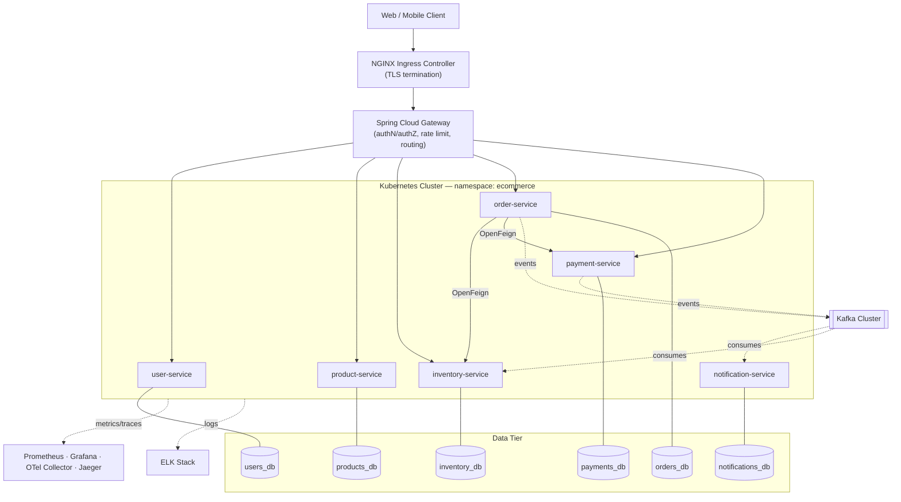

### Component diagram

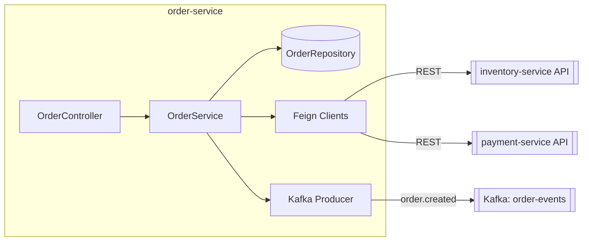

### Kubernetes deployment architecture

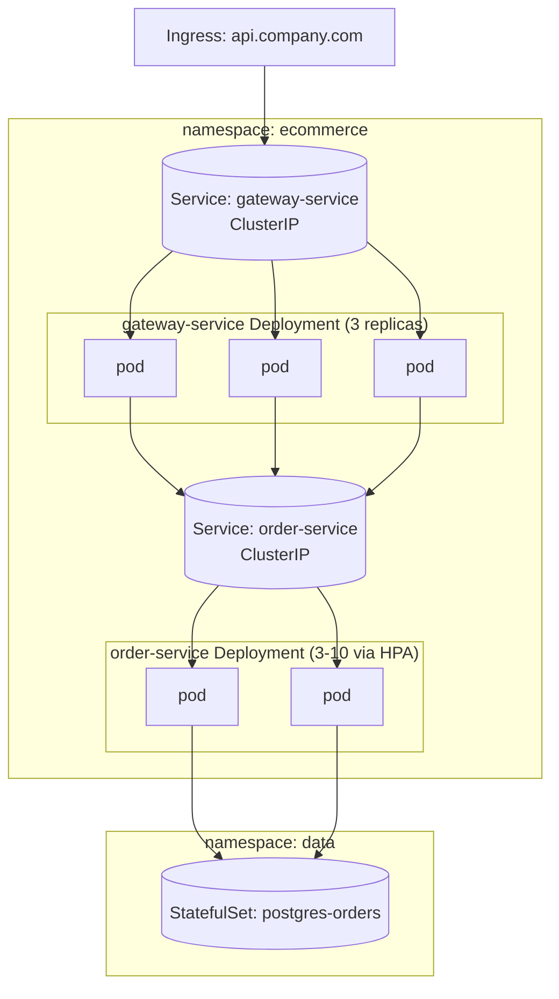

### Service-to-service communication

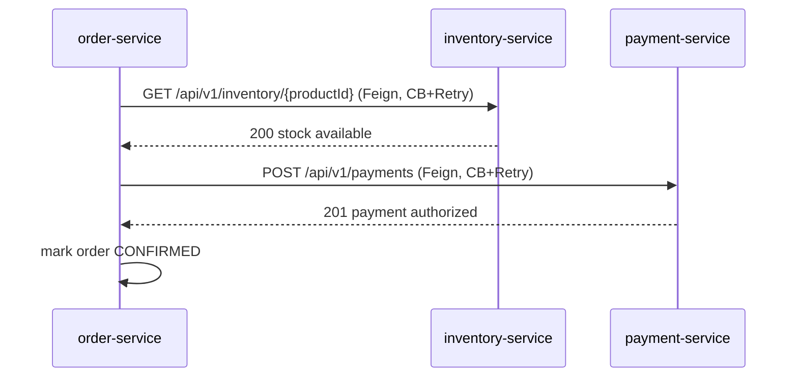

### Event-driven architecture

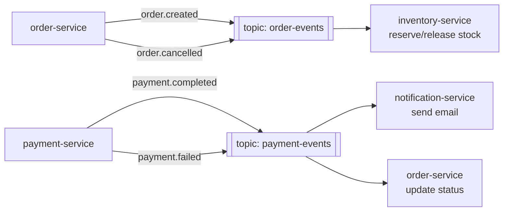

### Request flow — place an order

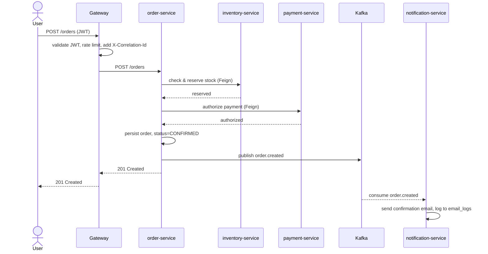

### Security architecture

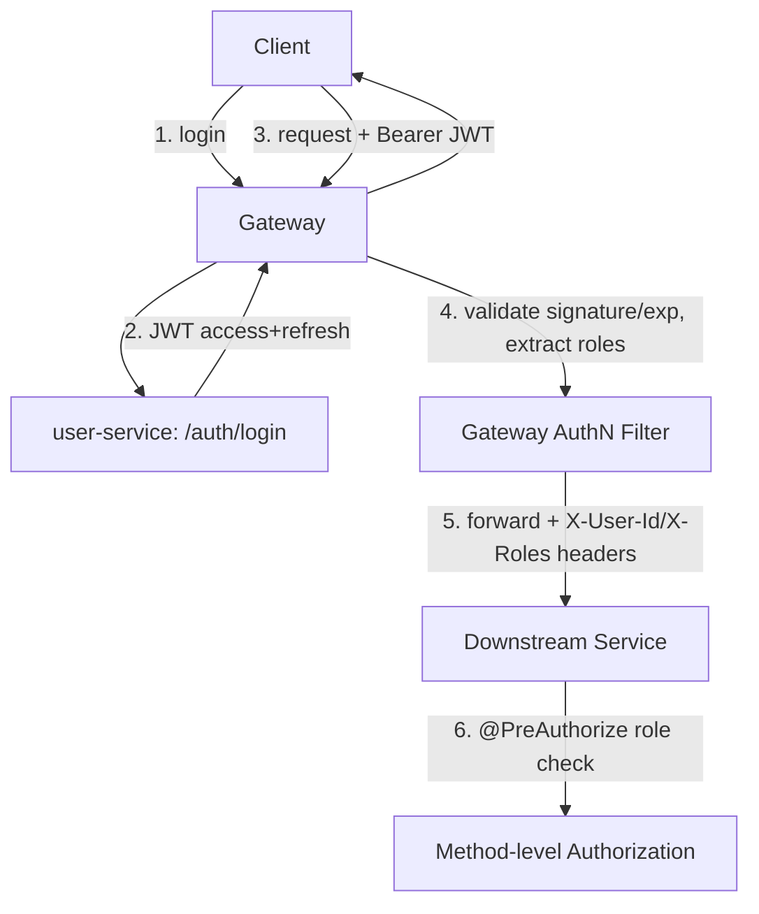

### Deployment topology

Multi-AZ cluster (3 nodes minimum across 3 zones). Stateless services scheduled with pod anti-affinity to spread replicas across zones; StatefulSets (Postgres) pinned per zone with async streaming replication to a standby in a second zone. Kafka runs as a 3-broker cluster (KRaft mode, no ZooKeeper) with `replication.factor=3`, `min.insync.replicas=2`.

### Key design decisions

*Decisions & rationale*

| Decision | Rationale |
|---|---|
| Database per service | No cross-service SQL joins; enforces the API as the only integration surface. |
| Kafka for order/payment/notification chain | Order placement must survive a temporarily-down notification service; async decouples availability. |
| Feign (sync) for inventory check + payment authorization | Order creation needs a same-request answer — "can I sell this, was payment approved" — before committing. |
| Kubernetes-native discovery, no Eureka | The platform already runs on K8s; CoreDNS + ClusterIP gives service discovery for free with one less stateful system to run. |
| Gateway rejects unauthenticated traffic at the edge; every service independently re-validates via OAuth2 Resource Server | Defense in depth — a service stays safe to call directly (internal traffic, tests) without trusting the gateway blindly, and gets standards-correct 401-vs-403 semantics for free instead of a hand-rolled filter. |
| Virtual threads on every Tomcat-backed service (`spring.threads.virtual.enabled`) | These are I/O-bound services (JDBC, Feign, Kafka) — virtual threads remove the platform-thread-pool ceiling on concurrent requests at effectively no code change. |

<a id="part2"></a>
## Part 2 — Database Design

Database-per-service. Each service owns its schema exclusively; no service reads another's tables directly. Cross-service references (e.g. an order's `customer_id`) are stored as opaque UUIDs with no FK constraint — referential integrity across services is enforced at the application/event level, not in SQL. Full Flyway migrations live at `<service>/src/main/resources/db/migration/`; this section shows the schema and the key DDL decisions.

### User Service — `users_db`

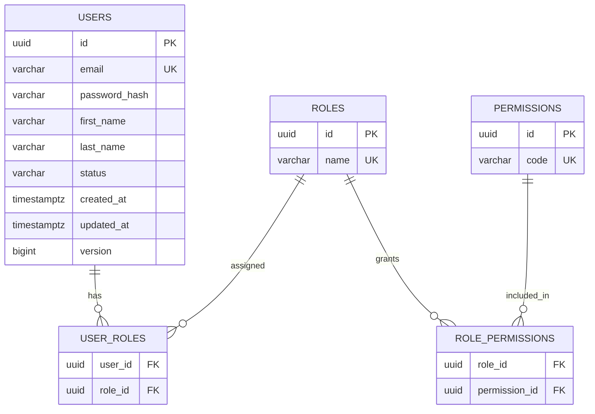

```sql
CREATE TABLE users (
    id              UUID PRIMARY KEY DEFAULT gen_random_uuid(),
    email           VARCHAR(255) NOT NULL,
    password_hash   VARCHAR(255) NOT NULL,
    first_name      VARCHAR(100) NOT NULL,
    last_name       VARCHAR(100) NOT NULL,
    status          VARCHAR(20)  NOT NULL DEFAULT 'ACTIVE',
    failed_login_attempts INT   NOT NULL DEFAULT 0,   -- brute-force protection, see Part 7
    locked_until    TIMESTAMPTZ,
    created_at      TIMESTAMPTZ  NOT NULL DEFAULT now(),
    updated_at      TIMESTAMPTZ  NOT NULL DEFAULT now(),
    version         BIGINT       NOT NULL DEFAULT 0,
    CONSTRAINT uq_users_email UNIQUE (email),
    CONSTRAINT ck_users_status CHECK (status IN ('ACTIVE','LOCKED','DISABLED'))
);
CREATE INDEX idx_users_status ON users (status);

CREATE TABLE roles (
    id    UUID PRIMARY KEY DEFAULT gen_random_uuid(),
    name  VARCHAR(50) NOT NULL,
    CONSTRAINT uq_roles_name UNIQUE (name)
);

CREATE TABLE permissions (
    id    UUID PRIMARY KEY DEFAULT gen_random_uuid(),
    code  VARCHAR(100) NOT NULL,
    CONSTRAINT uq_permissions_code UNIQUE (code)
);

CREATE TABLE user_roles (
    user_id UUID NOT NULL REFERENCES users(id) ON DELETE CASCADE,
    role_id UUID NOT NULL REFERENCES roles(id) ON DELETE RESTRICT,
    PRIMARY KEY (user_id, role_id)
);

CREATE TABLE role_permissions (
    role_id       UUID NOT NULL REFERENCES roles(id) ON DELETE CASCADE,
    permission_id UUID NOT NULL REFERENCES permissions(id) ON DELETE RESTRICT,
    PRIMARY KEY (role_id, permission_id)
);
```

### Product Service — `products_db`

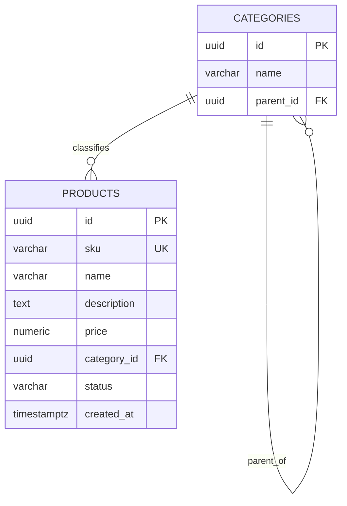

```sql
CREATE TABLE categories (
    id         UUID PRIMARY KEY DEFAULT gen_random_uuid(),
    name       VARCHAR(120) NOT NULL,
    parent_id  UUID REFERENCES categories(id) ON DELETE SET NULL,
    CONSTRAINT uq_categories_name_parent UNIQUE (name, parent_id)
);

CREATE TABLE products (
    id            UUID PRIMARY KEY DEFAULT gen_random_uuid(),
    sku           VARCHAR(64) NOT NULL,
    name          VARCHAR(255) NOT NULL,
    description   TEXT,
    price         NUMERIC(12,2) NOT NULL,
    category_id   UUID REFERENCES categories(id) ON DELETE SET NULL,
    status        VARCHAR(20) NOT NULL DEFAULT 'ACTIVE',
    created_at    TIMESTAMPTZ NOT NULL DEFAULT now(),
    updated_at    TIMESTAMPTZ NOT NULL DEFAULT now(),
    version       BIGINT NOT NULL DEFAULT 0,
    CONSTRAINT uq_products_sku UNIQUE (sku),
    CONSTRAINT ck_products_price CHECK (price >= 0)
);
CREATE INDEX idx_products_category ON products (category_id);
CREATE INDEX idx_products_name_trgm ON products USING gin (name gin_trgm_ops);
```

### Inventory Service — `inventory_db`

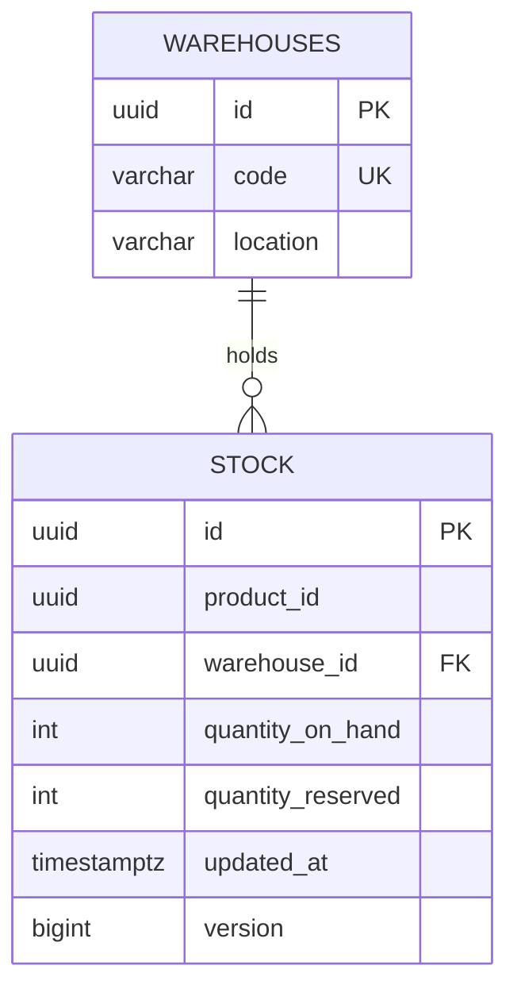

```sql
CREATE TABLE warehouses (
    id       UUID PRIMARY KEY DEFAULT gen_random_uuid(),
    code     VARCHAR(20) NOT NULL,
    location VARCHAR(255) NOT NULL,
    CONSTRAINT uq_warehouses_code UNIQUE (code)
);

CREATE TABLE stock (
    id                 UUID PRIMARY KEY DEFAULT gen_random_uuid(),
    product_id         UUID NOT NULL,
    warehouse_id       UUID NOT NULL REFERENCES warehouses(id) ON DELETE RESTRICT,
    quantity_on_hand   INT NOT NULL DEFAULT 0,
    quantity_reserved  INT NOT NULL DEFAULT 0,
    updated_at         TIMESTAMPTZ NOT NULL DEFAULT now(),
    version            BIGINT NOT NULL DEFAULT 0,
    CONSTRAINT uq_stock_product_warehouse UNIQUE (product_id, warehouse_id),
    CONSTRAINT ck_stock_nonneg CHECK (quantity_on_hand >= 0 AND quantity_reserved >= 0),
    CONSTRAINT ck_stock_reserved_lte_hand CHECK (quantity_reserved <= quantity_on_hand)
);
CREATE INDEX idx_stock_product ON stock (product_id);
```

`version` is a JPA `@Version` optimistic-lock column — stock decrements happen under high concurrency during flash sales, and optimistic locking with retry beats row-level pessimistic locks for throughput here.

### Order Service — `orders_db`

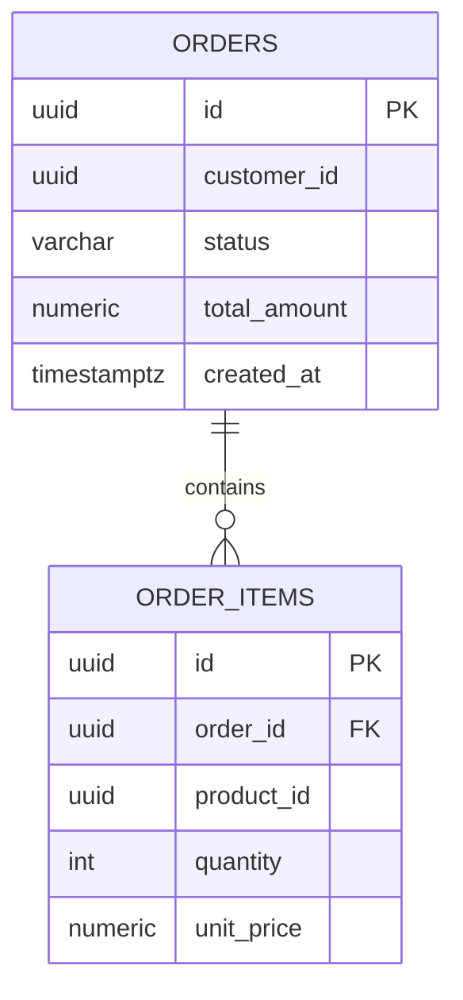

```sql
CREATE TABLE orders (
    id            UUID NOT NULL DEFAULT gen_random_uuid(),
    customer_id   UUID NOT NULL,
    status        VARCHAR(20) NOT NULL DEFAULT 'PENDING',
    total_amount  NUMERIC(12,2) NOT NULL,
    idempotency_key VARCHAR(255),        -- see Part 3, Idempotency-Key
    created_at    TIMESTAMPTZ NOT NULL DEFAULT now(),
    updated_at    TIMESTAMPTZ NOT NULL DEFAULT now(),
    version       BIGINT NOT NULL DEFAULT 0,
    CONSTRAINT ck_orders_status CHECK (status IN
      ('PENDING','CONFIRMED','PAID','SHIPPED','DELIVERED','CANCELLED','FAILED')),
    PRIMARY KEY (id, created_at)
) PARTITION BY RANGE (created_at);
CREATE UNIQUE INDEX uq_orders_idempotency_key ON orders (idempotency_key) WHERE idempotency_key IS NOT NULL;

-- Transactional outbox (see Part 6) — same schema shape in payment-service's payments_db
CREATE TABLE outbox_events (
    id             UUID PRIMARY KEY DEFAULT gen_random_uuid(),
    aggregate_type VARCHAR(50) NOT NULL,
    aggregate_id   UUID NOT NULL,
    event_type     VARCHAR(50) NOT NULL,
    topic          VARCHAR(100) NOT NULL,
    payload        JSONB NOT NULL,
    correlation_id VARCHAR(255),
    created_at     TIMESTAMPTZ NOT NULL DEFAULT now(),
    published_at   TIMESTAMPTZ
);
CREATE INDEX idx_outbox_events_unpublished ON outbox_events (created_at) WHERE published_at IS NULL;

CREATE TABLE orders_2026_q1 PARTITION OF orders
  FOR VALUES FROM ('2026-01-01') TO ('2026-04-01');
CREATE TABLE orders_2026_q2 PARTITION OF orders
  FOR VALUES FROM ('2026-04-01') TO ('2026-07-01');
-- new quarter partitions created ahead of time by a scheduled Flyway/cron job

CREATE INDEX idx_orders_customer ON orders (customer_id, created_at DESC);
CREATE INDEX idx_orders_status   ON orders (status) WHERE status NOT IN ('DELIVERED','CANCELLED');

CREATE TABLE order_items (
    id          UUID PRIMARY KEY DEFAULT gen_random_uuid(),
    order_id    UUID NOT NULL,
    order_created_at TIMESTAMPTZ NOT NULL,
    product_id  UUID NOT NULL,
    quantity    INT NOT NULL,
    unit_price  NUMERIC(12,2) NOT NULL,
    CONSTRAINT ck_order_items_qty CHECK (quantity > 0),
    FOREIGN KEY (order_id, order_created_at) REFERENCES orders(id, created_at) ON DELETE CASCADE
);
CREATE INDEX idx_order_items_order ON order_items (order_id);
```

Orders are range-partitioned by `created_at` quarterly — order volume is append-heavy and time-ordered, most reads target the current quarter, and old partitions can be moved to cheaper storage or dropped once past the retention window without a full table scan.

### Payment Service — `payments_db`

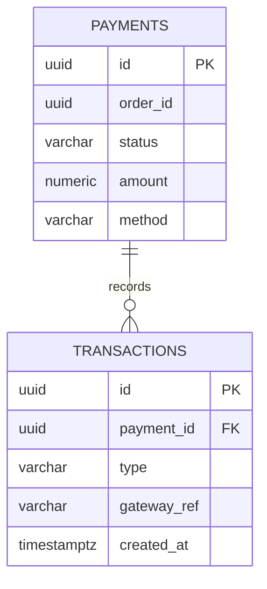

```sql
CREATE TABLE payments (
    id          UUID PRIMARY KEY DEFAULT gen_random_uuid(),
    order_id    UUID NOT NULL,
    status      VARCHAR(20) NOT NULL DEFAULT 'PENDING',
    amount      NUMERIC(12,2) NOT NULL,
    method      VARCHAR(30) NOT NULL,
    idempotency_key VARCHAR(255),        -- see Part 3, Idempotency-Key
    created_at  TIMESTAMPTZ NOT NULL DEFAULT now(),
    version     BIGINT NOT NULL DEFAULT 0,
    CONSTRAINT uq_payments_order UNIQUE (order_id),
    CONSTRAINT ck_payments_status CHECK (status IN ('PENDING','AUTHORIZED','CAPTURED','FAILED','REFUNDED'))
);
CREATE UNIQUE INDEX uq_payments_idempotency_key ON payments (idempotency_key) WHERE idempotency_key IS NOT NULL;
-- plus an outbox_events table identical in shape to order-service's (Part 2, Order Service)

CREATE TABLE transactions (
    id           UUID PRIMARY KEY DEFAULT gen_random_uuid(),
    payment_id   UUID NOT NULL REFERENCES payments(id) ON DELETE CASCADE,
    type         VARCHAR(20) NOT NULL,
    gateway_ref  VARCHAR(255),
    created_at   TIMESTAMPTZ NOT NULL DEFAULT now(),
    CONSTRAINT ck_transactions_type CHECK (type IN ('AUTH','CAPTURE','REFUND','VOID'))
);
CREATE INDEX idx_transactions_payment ON transactions (payment_id);
```

### Notification Service — `notifications_db`

```sql
CREATE TABLE notification_events (
    id          UUID PRIMARY KEY DEFAULT gen_random_uuid(),
    event_type  VARCHAR(50) NOT NULL,
    source_id   UUID NOT NULL,
    payload     JSONB NOT NULL,
    status      VARCHAR(20) NOT NULL DEFAULT 'RECEIVED',
    created_at  TIMESTAMPTZ NOT NULL DEFAULT now(),
    CONSTRAINT ck_notification_events_status CHECK (status IN ('RECEIVED','PROCESSED','FAILED')),
    -- Kafka's at-least-once delivery means this consumer can see the same event twice after a
    -- rebalance; this constraint is the dedup key (see Part 6, consumer idempotency) — payment-
    -- service's payments.order_id is already UNIQUE, so (event_type, source_id) is too.
    CONSTRAINT uq_notification_events_type_source UNIQUE (event_type, source_id)
);
CREATE INDEX idx_notification_events_source ON notification_events (source_id);

CREATE TABLE email_logs (
    id           UUID PRIMARY KEY DEFAULT gen_random_uuid(),
    event_id     UUID REFERENCES notification_events(id) ON DELETE SET NULL,
    recipient    VARCHAR(255) NOT NULL,
    subject      VARCHAR(255) NOT NULL,
    status       VARCHAR(20) NOT NULL DEFAULT 'QUEUED',
    sent_at      TIMESTAMPTZ,
    created_at   TIMESTAMPTZ NOT NULL DEFAULT now(),
    CONSTRAINT ck_email_logs_status CHECK (status IN ('QUEUED','SENT','FAILED'))
);
CREATE INDEX idx_email_logs_recipient ON email_logs (recipient, created_at DESC);
```

#### Cross-cutting rules

- **Primary keys:** UUID (`gen_random_uuid()`, pgcrypto) everywhere — safe to generate client-side, no cross-shard collision risk, doesn't leak sequential order counts.
- **Foreign keys:** only within a service's own schema. Cross-service references are plain UUID columns, validated at the application layer against the owning service's API/event stream, never via DB constraint.
- **Optimistic locking:** every mutable aggregate root carries a `version` column mapped to JPA `@Version`.
- **Migrations:** Flyway, one file per change, naming `V{n}__{description}.sql`, never edited after merge — see `order-service/src/main/resources/db/migration/V1__init_orders.sql` for the full reference implementation.

<a id="part3"></a>
## Part 3 — API Design

### Conventions

| | |
|---|---|
| Versioning | URI-based: `/api/v1/orders`. A breaking change ships as `/api/v2/...` alongside v1 until consumers migrate; additive changes (new optional fields) stay on v1. |
| Pagination | `?page=0&size=20` (zero-indexed), response wraps content in a `Page<T>` envelope with `totalElements`, `totalPages`. |
| Sorting | `?sort=createdAt,desc&sort=totalAmount,asc` — repeatable param, applied in order. |
| Filtering | `?status=CONFIRMED&customerId=...&createdAfter=2026-01-01` — resolved server-side via Spring Data JPA `Specification`, documented per-endpoint in OpenAPI. |
| Errors | RFC 7807 `application/problem+json` — see below. |
| OpenAPI | Currently unavailable: springdoc-openapi 2.8.17 (the latest release) still targets Spring Boot 3's package layout and throws `NoClassDefFoundError` against Boot 4.1's relocated `WebMvcProperties` (now `org.springframework.boot.webmvc.autoconfigure`), so it's been pulled from all six services pending a Boot-4-compatible springdoc release. No hand-rolled OpenAPI YAML fills the gap — endpoints are documented in this doc (see the per-service API tables) and exercised directly via the [Postman collection](#part21) instead. |

### Order API — representative contract

| Method | Path | Purpose | Auth |
|---|---|---|---|
| GET | `/api/v1/orders` | Paginated, filtered, sorted list | CUSTOMER (own), MANAGER/ADMIN (all) |
| GET | `/api/v1/orders/{id}` | Get one | owner or MANAGER/ADMIN |
| POST | `/api/v1/orders` | Create order | CUSTOMER |
| PUT | `/api/v1/orders/{id}` | Replace order (pre-CONFIRMED only) | owner |
| PATCH | `/api/v1/orders/{id}/status` | Transition status | MANAGER/ADMIN, or system (internal) |
| DELETE | `/api/v1/orders/{id}` | Cancel (soft, status=CANCELLED) | owner or ADMIN |

#### POST /api/v1/orders — request

```http
POST /api/v1/orders
Idempotency-Key: 5c1e2b7a-...-optional-client-generated-key

{
  "customerId": "9c2f...e11a",
  "items": [
    { "productId": "7ab1...c02d", "quantity": 2 }
  ]
}
```

#### 201 response (first request) / 200 response (replay)

```json
{
  "id": "b410...9f3e",
  "customerId": "9c2f...e11a",
  "status": "CONFIRMED",
  "totalAmount": 139.98,
  "items": [
    { "productId": "7ab1...c02d", "quantity": 2, "unitPrice": 69.99 }
  ],
  "createdAt": "2026-07-22T10:14:03Z"
}
```

#### Idempotency-Key (order-service and payment-service `POST` endpoints)

An optional client-supplied header, stored on a nullable, partial-unique-indexed column (`CREATE UNIQUE INDEX ... WHERE idempotency_key IS NOT NULL`, so rows without one never collide). On write, the service checks for an existing row with that key first; if found, it returns the original result unchanged — `200`, not `201`, so the client can tell "already happened" from "just happened" — instead of re-running the mutation (re-authorizing a payment, re-reserving inventory). A concurrent duplicate that races past the initial check is caught via `saveAndFlush` + a caught `DataIntegrityViolationException` on the unique-index violation, rather than a distributed lock: whichever request wins the insert is authoritative, the loser looks the winner's row up and returns it the same way a genuine replay would. This is what makes a client's retry-on-timeout safe — without it, a network timeout on an otherwise-successful `POST /orders` leaves the client unable to tell "never arrived" from "arrived, order placed, response lost," and a naive retry double-charges the customer.

#### Validation rules (Bean Validation)

- `customerId`: `@NotNull`
- `items`: `@NotEmpty`, each item `@Valid`
- `quantity`: `@Min(1)`, `@Max(999)`

#### Standard error response (RFC 9457)

```json
{
  "type": "https://api.company.com/problems/validation-error",
  "title": "Validation Failed",
  "status": 400,
  "detail": "items[0].quantity must be greater than 0",
  "instance": "/api/v1/orders",
  "correlationId": "3f7a9c21-..."
}
```

Produced by returning Spring's native `ProblemDetail` directly from each `@ExceptionHandler` — no hand-rolled error DTO. Spring MVC derives both the response status and the `application/problem+json` content type from the returned object; `correlationId` is attached as an RFC 9457 extension property via `ProblemDetail#setProperty`. Full request/response DTOs, OpenAPI YAML, and the global exception handler mapping every domain exception to a status + problem type live in `order-service` (see [repository layout](#part21)) — the pattern is identical across all six services.

<a id="part4"></a>
## Part 4 — Spring Boot Development Structure

Every service follows the same package layout, so once one is understood, all six are. `order-service` is the fully-implemented reference; the other five follow the identical shape with their own domain objects.

```text
com.ecommerce.order
├── controller/       REST endpoints, no business logic
├── service/          interfaces + impl, orchestrates use cases
├── repository/        Spring Data JPA + JPA Specifications
├── entity/           JPA aggregates
├── dto/              request/response records, never expose entities
├── mapper/           MapStruct entity <-> dto
├── config/           Feign, Kafka, Resilience4j, CORS beans
├── security/         JWT filter, SecurityConfig, method security
├── exception/        domain exceptions + GlobalExceptionHandler
├── event/            Kafka event DTOs + producer
└── integration/      Feign clients + fallback factories
```

SOLID is enforced structurally: controllers depend on service *interfaces* (dependency inversion), each mapper/service has one reason to change (single responsibility), new order status transitions extend a strategy map rather than branching further (open/closed), Feign fallbacks implement the same interface as the live client (Liskov), and clients only see the methods they call (interface segregation — e.g. `InventoryReadClient` vs a hypothetical write client).

<a id="part5"></a>
## Part 5 — Service Discovery — Kubernetes Native

No Eureka, no Consul. Kubernetes' built-in Service + CoreDNS *is* the service registry — running a second discovery system on top of a platform that already provides one is pure overhead. order-service's Feign clients (`InventoryClient`, `PaymentClient`, `ProductClient`) are declared with just `@FeignClient(name = "product-service")` — no explicit `url` — so resolution goes through Spring Cloud LoadBalancer, which needs *some* `DiscoveryClient` to ask "where is product-service?" Since there's no Eureka/Consul, that's Spring Cloud Commons' `SimpleDiscoveryClient`: a static, profile-scoped instance list, not a live registry.

#### How order-service finds product-service

1. product-service Deployment pods are fronted by a `Service` named `product-service`, `type: ClusterIP`, listening on port 80 and forwarding to the pod's actual container port.
2. Kubernetes assigns that Service a stable virtual IP and registers `product-service.ecommerce.svc.cluster.local` in CoreDNS (short form `product-service` resolves within the same namespace).
3. order-service's `kubernetes`-profile config registers that DNS name (no port — the Service already remaps 80 → the container's real port) as the one static instance `SimpleDiscoveryClient` hands back for `product-service`.
4. kube-proxy load-balances requests to that ClusterIP across all healthy pod endpoints (only pods passing their readiness probe are in the Endpoints list).

```yaml
// order-service/src/main/resources/application.yml — profile: kubernetes
spring:
  cloud:
    discovery:
      client:
        simple:
          instances:
            product-service[0]:
              uri: http://product-service.ecommerce.svc.cluster.local   # Service remaps 80 -> container port
```

> **Note:** Docker Compose has no Service layer, so it needs real ports. Plain `docker compose` networking resolves a service name to the container directly — there's no ClusterIP standing in front of it remapping port 80. The `docker`-profile block for the same property therefore points straight at each container's actual listening port:
>
> ```yaml
> // order-service/src/main/resources/application.yml — profile: docker
> spring:
>   cloud:
>     discovery:
>       client:
>         simple:
>           instances:
>             product-service[0]:
>               uri: http://product-service:8082   # the container's real port, not 80
> ```
>
> The same pattern applies to `inventory-service` and `payment-service`. gateway-service's own routes have the identical split — the base route `uri`s assume a K8s Service on port 80, with a `docker`-profile override supplying each service's literal port (see Part 21).

| | |
|---|---|
| Pod replacement | When a pod dies, the Deployment controller schedules a replacement; kubelet updates the Endpoints object as soon as the new pod passes its readiness probe. Callers never see a stale IP — they only ever resolve the Service's virtual IP, which never changes. |
| CoreDNS | Cluster add-on watching the K8s API for Service/Endpoint changes, serving DNS records for every Service automatically — no manual registration step, unlike Eureka's client-side self-registration. |
| Headless services | Used only for the Postgres StatefulSet, where callers need per-pod addressability (`postgres-0.postgres.data.svc`) instead of load-balanced access. |
| Why SimpleDiscoveryClient and not just a hardcoded Feign `url` | A hardcoded per-client `url` works too, but `SimpleDiscoveryClient` keeps every cross-service address in one place (`spring.cloud.discovery.client.simple.instances`) instead of scattered across each `@FeignClient`'s config block, and is a drop-in upgrade path to a real `DiscoveryClient` (Eureka, Consul, spring-cloud-kubernetes) later without touching the Feign interfaces themselves. |

<a id="part6"></a>
## Part 6 — Inter-Service Communication

Synchronous OpenFeign where the caller needs an answer before it can proceed (can we sell this? was payment approved?). Kafka where the producer doesn't need to know who's listening, or the consumer can safely react after the fact.

### Propagating the caller's JWT across Feign calls

The gateway isn't a trust boundary (see [Part 7](#part7)) — inventory-service and payment-service each independently validate the bearer token on every request, including ones that arrive from order-service rather than the gateway. That means order-service's Feign calls have to carry the *original customer's* token forward, not call downstream anonymously or with some service-account credential. A shared `FeignClientConfig` `RequestInterceptor` does this by reading the inbound request's `Authorization` header off `RequestContextHolder` and copying it onto every outbound Feign request:

```java
// config/FeignClientConfig.java
@Bean
public RequestInterceptor bearerTokenPropagationInterceptor() {
    return template -> {
        var attributes = RequestContextHolder.getRequestAttributes();
        if (attributes instanceof ServletRequestAttributes servletAttributes) {
            String authorization = servletAttributes.getRequest().getHeader(HttpHeaders.AUTHORIZATION);
            if (authorization != null) {
                template.header(HttpHeaders.AUTHORIZATION, authorization);
            }
        }
    };
}
```

Skipping this is a quiet failure mode worth naming explicitly: without it, every Feign call downstream still succeeds at the network level and still gets a well-formed HTTP response — just a `401`, because the callee's own OAuth2 Resource Server config correctly rejects the missing token. inventory-service also scopes its `POST /reserve` and `POST /release` endpoints to `CUSTOMER, MANAGER, ADMIN` rather than `MANAGER, ADMIN` like `POST /stock` — those two are invoked *as* the customer placing/cancelling an order, carrying that customer's own role, not an elevated one.

### order-service → inventory-service (Feign, synchronous)

```java
// integration/InventoryClient.java
@FeignClient(name = "inventory-service", configuration = FeignClientConfig.class,
             fallbackFactory = InventoryClientFallbackFactory.class)
public interface InventoryClient {
    @GetMapping("/api/v1/inventory/{productId}/availability")
    StockAvailabilityResponse checkAvailability(@PathVariable UUID productId,
                                                 @RequestParam int quantity);

    @PostMapping("/api/v1/inventory/{productId}/reserve")
    void reserve(@PathVariable UUID productId, @RequestBody ReserveStockRequest request);
}

// integration/InventoryClientFallbackFactory.java
@Component
public class InventoryClientFallbackFactory implements FallbackFactory<InventoryClient> {
    public InventoryClient create(Throwable cause) {
        return new InventoryClient() {
            public StockAvailabilityResponse checkAvailability(UUID productId, int quantity) {
                throw new InventoryUnavailableException(productId, cause);
            }
            public void reserve(UUID productId, ReserveStockRequest request) {
                throw new InventoryUnavailableException(productId, cause);
            }
        };
    }
}
```

### order-service → payment-service (Feign, synchronous)

```java
@FeignClient(name = "payment-service", fallbackFactory = PaymentClientFallbackFactory.class)
public interface PaymentClient {
    @PostMapping("/api/v1/payments/authorize")
    PaymentAuthorizationResponse authorize(@RequestBody AuthorizePaymentRequest request);
}
```

### payment-service → notification-service (Kafka, asynchronous — transactional outbox)

Producers don't call `KafkaTemplate` from the request thread. A direct "save the row, then publish to Kafka" dual write has a gap: a crash (or just a slow/failed broker) between the two silently drops the event, with the row committed and no one downstream ever notified. Instead, the event is written to an `outbox_events` table in the *same transaction* as the business row, so both commit or both roll back atomically; a separate `@Scheduled` poller drains unpublished rows to Kafka every 500ms and marks them published on success, retrying untouched on any send failure:

```java
// payment-service: event/PaymentEventProducer.java — runs inside the same @Transactional method that saves the Payment
@Component
@RequiredArgsConstructor
public class PaymentEventProducer {
    private final OutboxEventRepository outboxEventRepository;
    private final ObjectMapper objectMapper;

    public void publishCompleted(Payment payment) {
        var event = new PaymentCompletedEvent(payment.getId(), payment.getOrderId(),
                payment.getAmount(), Instant.now());
        outboxEventRepository.save(OutboxEvent.of("Payment", payment.getOrderId(), "PaymentCompletedEvent",
                "payment-events", objectMapper.writeValueAsString(event),
                MDC.get(CorrelationIdConstants.MDC_KEY)));   // captured now — the poller below runs on an
    }                                                        // unrelated scheduler thread with no MDC of its own
}

// payment-service: event/OutboxPublisher.java
@Component
@RequiredArgsConstructor
public class OutboxPublisher {
    private final OutboxEventRepository outboxEventRepository;
    private final KafkaTemplate<String, String> outboxKafkaTemplate;

    @Scheduled(fixedDelay = 500)
    public void publishPending() {
        for (OutboxEvent event : outboxEventRepository.findTop100ByPublishedAtIsNullOrderByCreatedAtAsc()) {
            try {
                var record = new ProducerRecord<>(event.getTopic(), null,
                        event.getAggregateId().toString(), event.getPayload());
                if (event.getCorrelationId() != null) {
                    record.headers().add(CorrelationIdConstants.HEADER,
                            event.getCorrelationId().getBytes(UTF_8));
                }
                outboxKafkaTemplate.send(record).get();
                event.markPublished();
                outboxEventRepository.save(event);
            } catch (Exception e) {
                // left unpublished — picked up again next poll
            }
        }
    }
}

// notification-service: event/PaymentEventConsumer.java
@Component
@RequiredArgsConstructor
public class PaymentEventConsumer {
    private final EmailService emailService;
    private final NotificationEventRepository notificationEventRepository;

    @KafkaListener(topics = "payment-events", groupId = "notification-service",
                   containerFactory = "paymentEventListenerFactory")
    @Transactional
    public void onPaymentCompleted(PaymentCompletedEvent event,
            @Header(name = CorrelationIdConstants.HEADER, required = false) String correlationId) {
        if (correlationId != null) MDC.put(CorrelationIdConstants.MDC_KEY, correlationId);
        try {
            // at-least-once delivery means this can be redelivered after a rebalance —
            // dedupe on (eventType, sourceId) before doing anything with side effects
            if (notificationEventRepository.existsByEventTypeAndSourceId("payment.completed", event.orderId())) {
                return;
            }
            notificationEventRepository.saveAndFlush(NotificationEvent.receive(/* ... */));
            emailService.sendPaymentConfirmation(event.orderId(), event.amount());
        } finally {
            MDC.remove(CorrelationIdConstants.MDC_KEY);
        }
    }
}
```

Two things worth calling out. First, the outbox row's payload is written as a pre-serialized JSON string (`ObjectMapper#writeValueAsString`), and `OutboxPublisher` sends it via a plain `KafkaTemplate<String, String>` — byte-identical on the wire to what a `JacksonJsonSerializer<Object>` producer would have sent, so `JacksonJsonDeserializer` consumers are unaffected by which producer-side approach wrote it. Second, the correlation id has to be captured into the outbox row *at write time*, not read from MDC again inside `OutboxPublisher` — MDC is thread-bound, and the poller runs on a completely different thread (a `@Scheduled` task) than the HTTP request that created the row, sometimes seconds later. Persisting it is the only way to carry a request's trace across that async gap; `PaymentEventConsumer` then restores it into its own MDC for the duration of processing, so a payment failure that only shows up three services downstream is still one `correlationId` query away from the original HTTP request in Kibana.

### Consumer error handling: retry + dead-letter topic

Before this, only Kafka deserialization failures were handled (via `ErrorHandlingDeserializer`) — a genuine processing exception inside the listener (a transient DB outage, a bug) caused the container to redeliver the same record forever, silently stalling that partition. A `DefaultErrorHandler` bounds that: three retries, 1s apart, then the record is routed to `payment-events.DLT` via a `DeadLetterPublishingRecoverer` and the offset is committed, so one poison message can't block everything behind it.

```java
// notification-service: config/KafkaConsumerConfig.java
@Bean
public DefaultErrorHandler kafkaErrorHandler(KafkaTemplate<String, Object> dlqKafkaTemplate) {
    var recoverer = new DeadLetterPublishingRecoverer(dlqKafkaTemplate);
    return new DefaultErrorHandler(recoverer, new FixedBackOff(1000L, 3L));
}

@Bean
public ConcurrentKafkaListenerContainerFactory<String, PaymentCompletedEvent> paymentEventListenerFactory(
        ConsumerFactory<String, PaymentCompletedEvent> paymentEventConsumerFactory,
        DefaultErrorHandler kafkaErrorHandler) {
    var factory = new ConcurrentKafkaListenerContainerFactory<String, PaymentCompletedEvent>();
    factory.setConsumerFactory(paymentEventConsumerFactory);
    factory.setCommonErrorHandler(kafkaErrorHandler);
    return factory;
}
```

### Kafka configuration (producer side)

```yaml
spring:
  kafka:
    bootstrap-servers: kafka-broker-0.kafka:9092,kafka-broker-1.kafka:9092,kafka-broker-2.kafka:9092
    producer:
      key-serializer: org.apache.kafka.common.serialization.StringSerializer
      value-serializer: org.springframework.kafka.support.serializer.JacksonJsonSerializer
      acks: all
      properties:
        enable.idempotence: true
        max.in.flight.requests.per.connection: 5
    consumer:
      group-id: notification-service
      auto-offset-reset: earliest
      key-deserializer: org.apache.kafka.common.serialization.StringDeserializer
      value-deserializer: org.springframework.kafka.support.serializer.JacksonJsonDeserializer
      properties:
        spring.json.trusted.packages: com.ecommerce.common.event
    topics:
      order-events: { partitions: 6, replication-factor: 3 }
      payment-events: { partitions: 6, replication-factor: 3 }
```

<a id="part7"></a>
## Part 7 — Security

### JWT flow

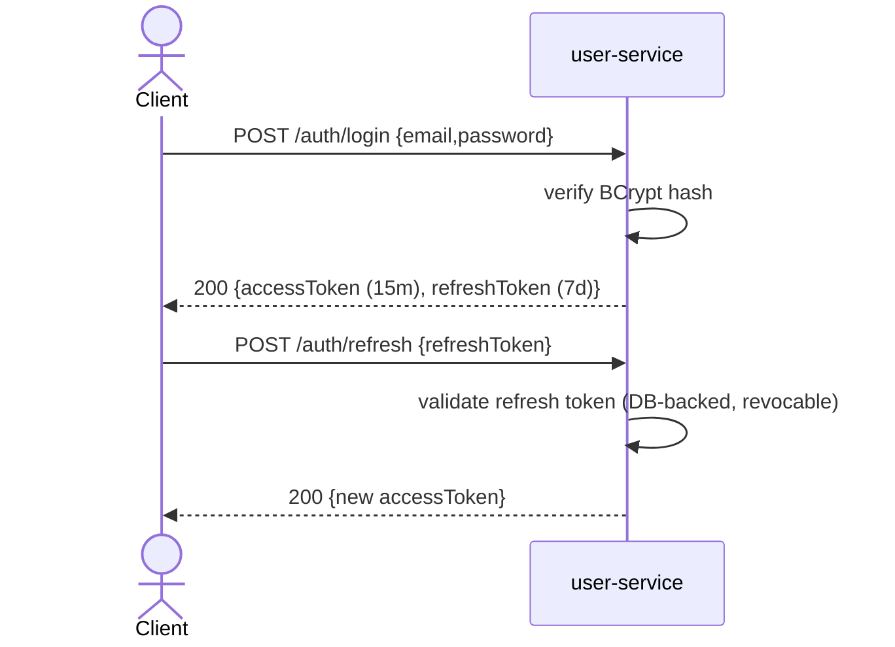

```java
// security/JwtService.java
@Component
public class JwtService {
    @Value("${security.jwt.secret}") private String secret;
    @Value("${security.jwt.access-ttl-minutes}") private long accessTtl;

    public String generateAccessToken(User user) {
        return Jwts.builder()
            .subject(user.getId().toString())
            .claim("roles", user.getRoles().stream().map(Role::getName).toList())
            .issuedAt(new Date())
            .expiration(Date.from(Instant.now().plus(accessTtl, ChronoUnit.MINUTES)))
            .signWith(signingKey(), Jwts.SIG.HS512)
            .compact();
    }

    public Jws<Claims> validate(String token) {
        return Jwts.parser().verifyWith(signingKey()).build().parseSignedClaims(token);
    }
}
```

#### Refresh token flow

Refresh tokens are opaque UUIDs persisted in `users_db.refresh_tokens` (hash only, with `expires_at` and `revoked_at`) — not JWTs themselves, so a compromised refresh token can be revoked server-side instantly, which a stateless JWT refresh token cannot.

### Spring Security configuration (OAuth2 Resource Server, per downstream service)

Each service validates the JWT via Spring Security's OAuth2 Resource Server support — `spring-boot-starter-oauth2-resource-server` + a `NimbusJwtDecoder` built from the shared HMAC secret — rather than a hand-rolled `OncePerRequestFilter`. The "roles" claim is mapped to `ROLE_*` authorities via `JwtGrantedAuthoritiesConverter`, so `hasRole()`/`hasAnyRole()` below are unchanged, and an invalid or expired bearer token now correctly produces `401` (via `BearerTokenAuthenticationEntryPoint`) instead of a filter silently clearing the security context.

```java
@Configuration
@EnableMethodSecurity
public class SecurityConfig {

    @Bean
    JwtDecoder jwtDecoder(@Value("${security.jwt.secret}") String secret) {
        var key = new SecretKeySpec(secret.getBytes(UTF_8), "HmacSHA512");
        return NimbusJwtDecoder.withSecretKey(key).macAlgorithm(MacAlgorithm.HS512).build();
    }

    @Bean
    JwtAuthenticationConverter jwtAuthenticationConverter() {
        var authorities = new JwtGrantedAuthoritiesConverter();
        authorities.setAuthoritiesClaimName("roles");
        authorities.setAuthorityPrefix("ROLE_");
        var converter = new JwtAuthenticationConverter();
        converter.setJwtGrantedAuthoritiesConverter(authorities);
        return converter;
    }

    @Bean
    SecurityFilterChain filterChain(HttpSecurity http, JwtDecoder jwtDecoder,
                                     JwtAuthenticationConverter jwtAuthenticationConverter) throws Exception {
        return http
            .csrf(CsrfConfigurer::disable)          // stateless, token-based API — no cookie session to forge
            .sessionManagement(sm -> sm.sessionCreationPolicy(SessionCreationPolicy.STATELESS))
            .authorizeHttpRequests(auth -> auth
                .requestMatchers("/actuator/health/**").permitAll()
                .requestMatchers(HttpMethod.GET, "/api/v1/orders/**").hasAnyRole("CUSTOMER","MANAGER","ADMIN")
                .requestMatchers(HttpMethod.POST, "/api/v1/orders").hasRole("CUSTOMER")
                .requestMatchers(HttpMethod.PATCH, "/api/v1/orders/*/status").hasAnyRole("MANAGER","ADMIN")
                .anyRequest().authenticated())
            .oauth2ResourceServer(oauth2 -> oauth2.jwt(jwt -> jwt
                .decoder(jwtDecoder)
                .jwtAuthenticationConverter(jwtAuthenticationConverter)))
            .build();
    }
}
```

### RBAC model

| Role | Can |
|---|---|
| CUSTOMER | Create/view own orders, view catalog, manage own profile |
| MANAGER | All CUSTOMER permissions + view/update any order status, manage inventory/products |
| ADMIN | All permissions + user/role management, refunds, system configuration |

#### Password encryption

`BCryptPasswordEncoder`, strength 12. Never logged, never returned in any DTO (entity → DTO mapper simply has no mapping for the field).

#### Brute-force protection

Two independent layers, since either one bypassed on its own (a script hitting user-service directly on `:8081`, skipping the gateway) shouldn't leave login unprotected. At the gateway, the `/users/auth/**` route carries its own `RequestRateLimiter`, keyed by remote IP rather than the platform-wide `userKeyResolver` (there's no `X-User-Id` yet pre-login, so every anonymous caller would otherwise share one global bucket) at a much stricter rate than general API traffic:

```yaml
# gateway-service/application.yml
- id: user-service-auth
  predicates: [ "Path=/users/auth/**" ]
  filters:
    - name: RequestRateLimiter
      args:
        redis-rate-limiter.replenishRate: 2
        redis-rate-limiter.burstCapacity: 5
        key-resolver: "#{@ipKeyResolver}"
```

Defense in depth, in user-service itself: each `User` row tracks `failed_login_attempts` and `locked_until`. Five consecutive failures locks the account for 15 minutes (`423 Locked` on any login attempt in that window, checked *before* the password comparison so a locked-out account can't keep being probed for free); a successful login resets the counter. This does mean a locked response is distinguishable from "wrong password" — a small, accepted enumeration tradeoff, since the alternative is telling a legitimately locked-out user nothing about why they can't log in.

```java
// user-service: entity/User.java
public void recordFailedLogin() {
    failedLoginAttempts++;
    if (failedLoginAttempts >= MAX_FAILED_LOGIN_ATTEMPTS) {
        lockedUntil = Instant.now().plus(LOCKOUT_MINUTES, ChronoUnit.MINUTES);
    }
}
```

#### CORS

Configured once at the gateway (Spring Cloud Gateway's `globalcors`, not Spring Security — the gateway is reactive/WebFlux and has no `SecurityFilterChain` of its own) with an explicit allow-list of origins, no wildcard `*`. `allowCredentials` stays `false`: auth is a bearer token in the `Authorization` header, not a cookie, so there's no session credential for a credentialed cross-origin request to leak. Downstream services trust the gateway and don't re-implement CORS.

```yaml
# gateway-service/application.yml
spring:
  cloud:
    gateway:
      server:
        webflux:
          globalcors:
            cors-configurations:
              '[/**]':
                allowedOrigins: ${CORS_ALLOWED_ORIGINS:http://localhost:3000}
                allowedMethods: [ GET, POST, PUT, PATCH, DELETE, OPTIONS ]
                allowedHeaders: [ Authorization, Content-Type, Idempotency-Key, X-Correlation-Id ]
                exposedHeaders: [ X-Correlation-Id, Location ]
                allowCredentials: false
```

#### Security headers

Set at two layers for the same reason as brute-force protection above: the gateway (a `GlobalFilter`, since every browser-facing response passes through it) and, redundantly, each service's own `SecurityConfig`, so calling a service directly still gets the same hardening the JWT check already gives it. Every response here is JSON, never HTML, so the policy is maximally restrictive rather than tuned for a page that renders anything: `Content-Security-Policy: default-src 'none'; frame-ancestors 'none'`, `Referrer-Policy: no-referrer`, `Permissions-Policy` disabling geolocation/camera/microphone/payment, plus `X-Content-Type-Options: nosniff`, `X-Frame-Options: DENY`, and (gateway only, since it's the actual TLS-terminating edge) `Strict-Transport-Security`.

```java
// each service: security/SecurityConfig.java
.headers(headers -> headers
    .contentSecurityPolicy(csp -> csp.policyDirectives("default-src 'none'; frame-ancestors 'none'"))
    .referrerPolicy(referrer -> referrer.policy(ReferrerPolicyHeaderWriter.ReferrerPolicy.NO_REFERRER))
    .permissionsPolicyHeader(permissions -> permissions.policy(
            "geolocation=(), camera=(), microphone=(), payment=()")))
```

#### CSRF

Disabled cluster-wide. This is a token-authenticated API with no browser-managed session cookie, so there's no ambient credential for CSRF to hijack — CSRF protection is a session-cookie concern.

<a id="part8"></a>
## Part 8 — API Gateway

```yaml
# gateway-service/src/main/resources/application.yml
spring:
  cloud:
    gateway:
      routes:
        - id: user-service
          uri: http://user-service
          predicates: [ "Path=/users/**" ]
          filters: [ StripPrefix=0, "CircuitBreaker=name=userServiceCB" ]
        - id: product-service
          uri: http://product-service
          predicates: [ "Path=/products/**" ]
        - id: inventory-service
          uri: http://inventory-service
          predicates: [ "Path=/inventory/**" ]
        - id: order-service
          uri: http://order-service
          predicates: [ "Path=/orders/**" ]
          filters:
            - name: RequestRateLimiter
              args: { redis-rate-limiter.replenishRate: 50, redis-rate-limiter.burstCapacity: 100 }
        - id: payment-service
          uri: http://payment-service
          predicates: [ "Path=/payments/**" ]
        - id: user-service-auth
          predicates: [ "Path=/users/auth/**" ]
          filters:
            - name: RequestRateLimiter    # stricter, IP-keyed — see Part 7, Brute-force protection
              args: { redis-rate-limiter.replenishRate: 2, redis-rate-limiter.burstCapacity: 5, key-resolver: "#{@ipKeyResolver}" }
```

Gateway-level `GlobalFilter`s (ordered): correlation ID assignment → JWT validation → rate limiting → security response headers → structured request/response logging. Auth, rate limiting, CORS (`globalcors`, see Part 7), and security headers are all applied gateway-wide rather than per-route, so every route gets them without repetition.

### Request lifecycle

1. NGINX Ingress terminates TLS, forwards to gateway Service.
2. `CorrelationIdGlobalFilter` — reads or generates `X-Correlation-Id`, adds it to the outgoing request and the eventual response.
3. `JwtAuthenticationGlobalFilter` — rejects (401) missing/invalid tokens; on success, injects `X-User-Id` / `X-User-Roles` headers for downstream trust.
4. `RequestRateLimiter` (Redis token-bucket) — 429 on exceeded quota; keyed by user id on most routes, by remote IP on `/users/auth/**` (see Part 7).
5. Route predicate matches path, forwards to the ClusterIP Service.
6. Downstream service enforces method-level `@PreAuthorize` using the forwarded role header.
7. `SecurityHeadersGlobalFilter` adds CSP/Referrer-Policy/Permissions-Policy/HSTS to the response (see Part 7).
8. Response logged with status, latency, correlation id; returned to client.

<a id="part9"></a>
## Part 9 — Observability

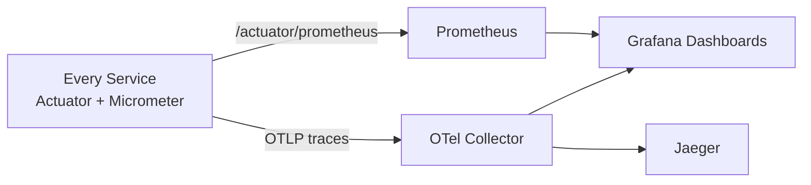

- **Metrics:** Spring Boot Actuator + Micrometer registry → Prometheus scrape at `/actuator/prometheus`. JVM (heap, GC pauses), HTTP (latency histograms, 4xx/5xx rate per route), Kafka consumer lag, HikariCP pool saturation, Resilience4j circuit-breaker state. Every `k8s/deployment.yaml` (and Helm template) carries the `prometheus.io/scrape`/`port`/`path` pod annotations Prometheus's Kubernetes service-discovery job filters on — without them the scrape config silently discovers nothing.
- **Tracing:** `spring-boot-starter-opentelemetry` (Boot 4.1's consolidated OTel starter — Micrometer's tracing bridge + the OTLP exporter in one dependency) on every service; spans pushed via OTLP/HTTP to the Collector, which forwards to Jaeger. Trace ID = correlation ID propagated end to end.
- **Dashboards:** Grafana: per-service golden signals (rate/errors/duration/saturation) for all seven services, a platform-wide order funnel (created → confirmed → paid → shipped), Kafka consumer-lag board, Postgres connection/replication board.
- **Alerting:** Prometheus Alertmanager rules: error rate >2% over 5m, p99 latency >1s, consumer lag >10k, pod restart loop, HPA at max replicas sustained.

> **Note:** Where this actually runs: `kubernetes/observability/` has working manifests for the full stack (Prometheus, Grafana, OTel Collector, Jaeger, plus RBAC for Prometheus's Kubernetes service discovery) — `kubectl apply -f kubernetes/observability/` stands it up in its own `observability` namespace. For local dev, the same stack is wired into `docker-compose.yaml`. These are reference-tier, single-replica manifests; a real production install would swap Prometheus/Grafana for the `prometheus-community/kube-prometheus-stack` Helm chart rather than hand-rolled Deployments, for the Operator, Alertmanager clustering, and node-exporter/kube-state-metrics that come with it.

<a id="part10"></a>
## Part 10 — Logging

Structured JSON via Spring Boot's native structured logging (`logging.structured.format.console: logstash`, Boot 3.4+) — a one-line property, no external encoder dependency or hand-maintained `logback-spring.xml` per service. Correlation ID is injected through MDC by the same gateway filter that assigns it, propagated to downstream services as an HTTP header and copied into MDC there too; Boot's structured formatter includes the full MDC context automatically.

```json
{
  "timestamp": "2026-07-22T10:14:03.221Z",
  "level": "INFO",
  "service": "order-service",
  "traceId": "3f7a9c21b8e4...",
  "correlationId": "3f7a9c21-88e4-4a11-9c02-1d7e5f0a9b31",
  "logger": "com.ecommerce.order.service.OrderService",
  "message": "Order confirmed",
  "orderId": "b410...9f3e",
  "customerId": "9c2f...e11a"
}
```

Filebeat ships container stdout to Logstash → Elasticsearch; Kibana dashboards are built around `correlationId` so a single request's full cross-service log trail is one query away.

> **Note:** Where this actually runs: `kubernetes/observability/` includes Elasticsearch (single-node StatefulSet), Logstash, Kibana, and a Filebeat DaemonSet with the RBAC it needs for Kubernetes pod-metadata enrichment. The docker-compose stack mirrors this with a Docker-autodiscover Filebeat config instead (no Kubernetes API to query locally). As with the metrics stack, a real production install typically uses the Elastic Cloud on Kubernetes (ECK) operator instead of hand-rolled Elasticsearch StatefulSets.

<a id="part11"></a>
## Part 11 — Dockerization

```dockerfile
# order-service/Dockerfile
FROM eclipse-temurin:25-jdk-alpine AS build
WORKDIR /app
COPY gradlew settings.gradle build.gradle ./
COPY gradle ./gradle
COPY common ./common
COPY order-service ./order-service
RUN ./gradlew :order-service:bootJar -x test --no-daemon

FROM eclipse-temurin:25-jre-alpine
RUN addgroup -S spring && adduser -S spring -G spring
WORKDIR /app
COPY --from=build /app/order-service/build/libs/*.jar app.jar
USER spring:spring
EXPOSE 8084
ENTRYPOINT ["java","-XX:+UseContainerSupport","-XX:MaxRAMPercentage=75","-jar","app.jar"]
```

Multi-stage keeps the runtime image to a JRE + jar (no build toolchain in the final layer), Alpine base minimizes size, non-root user satisfies pod security standards, and `-XX:MaxRAMPercentage` respects the container's cgroup memory limit rather than the host's.

Full `docker-compose.yaml` (Postgres ×6, Kafka in KRaft mode, all seven services) is at the repository root — see [Part 21](#part21).

<a id="part12"></a>
## Part 12 — Kubernetes Deployment

Every service ships `deployment.yaml`, `service.yaml`, `configmap.yaml`, `secret.yaml`, and `hpa.yaml` under `<service>/k8s/` (also templated in Helm — see [Part 15](#part15)). Common probe/resource shape:

```yaml
containers:
  - name: order-service
    image: registry.company.com/ecommerce/order-service:{{ .Values.image.tag }}
    ports: [{ containerPort: 8084 }]
    envFrom:
      - configMapRef: { name: order-service-config }
      - secretRef: { name: order-service-secret }
    resources:
      requests: { cpu: "250m", memory: "512Mi" }
      limits:   { cpu: "1",    memory: "1Gi" }
    startupProbe:
      httpGet: { path: /actuator/health, port: 8084 }
      failureThreshold: 30
      periodSeconds: 5
    readinessProbe:
      httpGet: { path: /actuator/health/readiness, port: 8084 }
      periodSeconds: 10
    livenessProbe:
      httpGet: { path: /actuator/health/liveness, port: 8084 }
      periodSeconds: 15
      failureThreshold: 3
```

Startup probe absorbs JVM + Flyway migration + connection pool warm-up before liveness is even evaluated, so a slow-starting pod isn't killed mid-boot. HPA targets 70% CPU and 75% memory, min 3 / max 10 replicas for `order-service` and `product-service` (highest read traffic), min 2 / max 5 for the rest.

<a id="part13"></a>
## Part 13 — Ingress

```yaml
apiVersion: networking.k8s.io/v1
kind: Ingress
metadata:
  name: ecommerce-ingress
  namespace: ecommerce
  annotations:
    nginx.ingress.kubernetes.io/ssl-redirect: "true"
    cert-manager.io/cluster-issuer: letsencrypt-prod
spec:
  ingressClassName: nginx
  tls:
    - hosts: [api.company.com]
      secretName: api-company-com-tls
  rules:
    - host: api.company.com
      http:
        paths:
          - path: /users
            pathType: Prefix
            backend: { service: { name: gateway-service, port: { number: 80 } } }
          - path: /products
            pathType: Prefix
            backend: { service: { name: gateway-service, port: { number: 80 } } }
          - path: /orders
            pathType: Prefix
            backend: { service: { name: gateway-service, port: { number: 80 } } }
```

All host paths route to the single gateway Service — the gateway, not the Ingress, owns per-service routing (see Part 8). This keeps routing logic in one testable Spring bean set instead of split across Ingress annotations and gateway config. TLS is cert-manager-issued Let's Encrypt, auto-renewed; the Ingress terminates TLS, cluster-internal traffic is plain HTTP behind the mesh boundary.

<a id="part14"></a>
## Part 14 — PostgreSQL in Kubernetes

```yaml
apiVersion: apps/v1
kind: StatefulSet
metadata: { name: postgres-orders, namespace: data }
spec:
  serviceName: postgres-orders
  replicas: 1
  selector: { matchLabels: { app: postgres-orders } }
  template:
    metadata: { labels: { app: postgres-orders } }
    spec:
      containers:
        - name: postgres
          image: postgres:16-alpine
          ports: [{ containerPort: 5432 }]
          envFrom: [{ secretRef: { name: postgres-orders-secret } }]
          volumeMounts:
            - { name: data, mountPath: /var/lib/postgresql/data }
          resources:
            requests: { cpu: "500m", memory: "1Gi" }
            limits:   { cpu: "2",    memory: "4Gi" }
  volumeClaimTemplates:
    - metadata: { name: data }
      spec:
        accessModes: [ReadWriteOnce]
        storageClassName: gp3-encrypted
        resources: { requests: { storage: 50Gi } }
```

**Backup:** nightly `pg_basebackup` + continuous WAL archiving to object storage (e.g. via `pgBackRest` sidecar), 30-day retention, weekly restore drill into a scratch namespace to verify backups are actually restorable. **Recovery:** point-in-time recovery from WAL archive; RPO ~5 minutes (WAL shipping interval), RTO target 30 minutes for a full restore.

> **Note:** **Recommendation:** self-managed StatefulSet Postgres is reasonable for dev/qa. For UAT/prod, prefer a managed service — **AWS RDS for PostgreSQL** (or Aurora PostgreSQL for higher throughput) or **Azure Database for PostgreSQL Flexible Server** — to offload patching, failover, PITR, and backup verification to the provider. Self-hosting stateful databases in K8s is operationally the highest-risk piece of this stack; only take it on if there's a concrete reason (data residency, cost at extreme scale) to avoid a managed offering.

<a id="part15"></a>
## Part 15 — Helm Charts

```text
helm/
├── ecommerce-platform/         # umbrella chart
│   ├── Chart.yaml               (dependencies: each service subchart)
│   ├── values.yaml               shared defaults
│   ├── values-dev.yaml
│   ├── values-qa.yaml
│   ├── values-uat.yaml
│   ├── values-prod.yaml
│   └── charts/
│       ├── order-service/
│       │   ├── Chart.yaml
│       │   ├── values.yaml
│       │   └── templates/
│       │       ├── deployment.yaml
│       │       ├── service.yaml
│       │       ├── configmap.yaml
│       │       ├── secret.yaml
│       │       ├── hpa.yaml
│       │       └── _helpers.tpl
│       ├── user-service/  (same shape)
│       ├── product-service/
│       ├── inventory-service/
│       ├── payment-service/
│       ├── notification-service/
│       └── gateway-service/
```

Env-specific values differ in replica counts, resource limits, log level, and external secret refs — never in template logic:

| Env | Replicas (order-service) | Resources | Log level |
|---|---|---|---|
| dev | 1 | request 100m/256Mi | DEBUG |
| qa | 2 | request 250m/512Mi | INFO |
| uat | 2 | request 250m/512Mi | INFO |
| prod | 3 (HPA to 10) | request 250m/512Mi, limit 1/1Gi | WARN |

Deploy: `helm upgrade --install ecommerce ./helm/ecommerce-platform -f values-prod.yaml -n ecommerce`

<a id="part16"></a>
## Part 16 — CI/CD

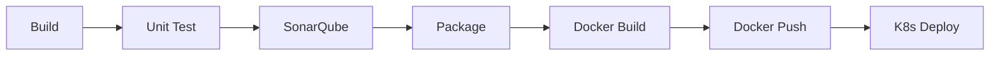

One GitHub Actions workflow per service (path-filtered so a change to `order-service/` only rebuilds `order-service`) — `.github/workflows/{gateway,user,product,inventory,order,payment,notification}-service.yml`, all seven following the identical build → test → `sonar` → package → Docker → deploy shape. Deploy stage runs `helm upgrade` against the target namespace, gated on branch (`develop`→dev, tags→prod with manual approval environment). The `sonar` task exists because the `org.sonarqube` Gradle plugin is applied platform-wide in the root `build.gradle`'s `subprojects {}` block, not per service.

<a id="part17"></a>
## Part 17 — Testing Strategy

- **Unit — JUnit 5 + Mockito:** Service layer in isolation, repositories/clients mocked. Fast, run on every commit.
- **Integration — Testcontainers:** Real PostgreSQL + Kafka containers per test class, wired via `@ServiceConnection` (Boot auto-configures the datasource from the running container — no manual `@DynamicPropertySource` boilerplate); repository queries, Flyway migrations, and Kafka producer/consumer round-trips verified against real engines, not H2.
- **API — MockMvc / WebTestClient:** Controller slice tests asserting HTTP status, JSON shape, validation error format.
- **Performance — k6 / Gatling:** Order-creation path load-tested at 5x expected peak; consumer-lag and p99 latency watched under load.

Coverage gate (JaCoCo) enforced in CI at 80% line coverage on `service` and `mapper` packages (`filter`/`config` for gateway-service, which has neither); controllers and config classes excluded from the gate (thin, tested via API tests instead). All seven services carry this same test shape — unit + controller/filter + Testcontainers (or, for gateway-service, unit + WebFlux slice, since it has no database of its own). `order-service` additionally has `JwtResourceServerIntegrationTest`, which signs real HMAC JWTs with Nimbus and posts them through the actual `JwtDecoder` bean — proving the OAuth2 Resource Server wiring end to end, not just that `@WithMockUser` satisfies the authorization rules.

<a id="part18"></a>
## Part 18 — Resiliency — Resilience4j

```yaml
resilience4j:
  circuitbreaker:
    instances:
      inventory-service:
        slidingWindowSize: 20
        failureRateThreshold: 50
        waitDurationInOpenState: 10s
        permittedNumberOfCallsInHalfOpenState: 5
  retry:
    instances:
      inventory-service: { maxAttempts: 3, waitDuration: 200ms, retryExceptions: [java.io.IOException] }
  bulkhead:
    instances:
      inventory-service: { maxConcurrentCalls: 25 }
  ratelimiter:
    instances:
      payment-service: { limitForPeriod: 100, limitRefreshPeriod: 1s, timeoutDuration: 500ms }
```

In practice, the circuit breaker/retry/bulkhead instances above wrap the Feign clients declaratively rather than via method-level `@CircuitBreaker`/`@Retry`/`@Bulkhead` annotations — the instance name matches the `@FeignClient`'s `name`, and the fallback is the client's own `fallbackFactory` (see Part 6), invoked automatically for any exception the call throws, connection failure or decoded HTTP error alike:

```java
// integration/InventoryClient.java
@FeignClient(name = "inventory-service", configuration = FeignClientConfig.class,
             fallbackFactory = InventoryClientFallbackFactory.class)
public interface InventoryClient {
    @PostMapping("/api/v1/inventory/{productId}/reserve")
    void reserve(@PathVariable UUID productId, @RequestBody ReserveStockRequest request);
}

// integration/InventoryClientFallbackFactory.java — runs on circuit-open or any call failure
public InventoryClient create(Throwable cause) {
    return new InventoryClient() {
        public void reserve(UUID productId, ReserveStockRequest request) {
            throw new InventoryUnavailableException(productId, cause);
        }
    };
}
```

Circuit breaker protects order-service from a degraded inventory-service turning into a full outage; retry only wraps idempotent GETs and the idempotent reserve call (guarded by an idempotency key); bulkhead caps concurrent Feign calls so one slow dependency can't exhaust the order-service thread pool; rate limiter on payment-service protects the actual payment gateway's own rate limits.

> **Note:** **Two Boot-4.1/Spring-Cloud-2025.1.2-specific traps, both silent.** First: Feign only wraps calls with a circuit breaker (and only ever invokes `fallbackFactory`) when `spring.cloud.openfeign.circuitbreaker.enabled: true` is set — the older, commonly-documented `feign.circuitbreaker.enabled` key is *not* equivalent and is silently ignored, leaving every fallback factory as dead code with no error at startup. Second: `spring-cloud-starter-circuitbreaker-resilience4j` (needed to get a `CircuitBreakerFactory` bean at all — without one, the property above has nothing to activate) still transitively pulls `io.github.resilience4j:resilience4j-spring-boot3` as of Spring Cloud 2025.1.2, which double-registers autoconfiguration beans against this project's `resilience4j-spring-boot4` and fails the app at startup with a `BeanDefinitionOverrideException`. Exclude it explicitly:
>
> ```groovy
> // order-service/build.gradle
> implementation('org.springframework.cloud:spring-cloud-starter-circuitbreaker-resilience4j') {
>     exclude group: 'io.github.resilience4j', module: 'resilience4j-spring-boot3'
> }
> ```

<a id="part19"></a>
## Part 19 — Scalability

| | |
|---|---|
| Horizontal (services) | Stateless services scale via HPA on CPU/memory (and optionally custom metrics — Kafka lag for consumers). No sticky sessions, so any replica handles any request. |
| Vertical | Used sparingly — mainly for Postgres primaries where connection/buffer-pool overhead makes horizontal scale-out costly; VPA recommender used in dev to right-size requests before prod rollout. |
| Kafka | Scale by adding brokers + increasing topic partition count (partition count sets the consumer-parallelism ceiling); consumer group instances scale independently up to partition count. |
| PostgreSQL | Read replicas for read-heavy services (product-service catalog reads); partitioning (orders, Part 2) keeps individual indexes small; connection pooling via PgBouncer in front of each database to survive pod-count bursts. |
| Kubernetes cluster | Cluster Autoscaler adds nodes when pods are unschedulable due to resource pressure; node pools separated for stateless workloads vs. Postgres/Kafka (different resource profiles). |

<a id="part20"></a>
## Part 20 — Production Readiness Checklist

| Area | Checks |
|---|---|
| Security | JWT secret in Vault/Secrets Manager (not ConfigMap) · TLS everywhere at ingress · dependency CVE scan in CI · non-root containers · network policies restricting pod-to-pod traffic to declared edges · CORS allow-list (not wildcard) at the gateway · CSP/Referrer-Policy/Permissions-Policy on every response · account lockout + IP-keyed rate limit on login |
| Performance | Load test at 5x peak passed · p99 latency budget defined per endpoint · DB indexes match actual query plans (`EXPLAIN ANALYZE` reviewed) |
| Reliability | Circuit breakers on every cross-service call · idempotency keys on payment/order mutation endpoints · transactional outbox (no dual-write gap between DB commit and Kafka publish) · Kafka consumer idempotency (dedup on redelivery) + retry with dead-letter topic |
| Availability | Multi-AZ node spread · PodDisruptionBudgets set · zero-downtime rolling deploys verified · readiness gates block traffic during deploy |
| Disaster recovery | Backup restore drill executed and timed · runbook for full-region failover documented · RPO/RTO agreed with stakeholders |
| DevOps | CI gate on test coverage + Sonar quality gate · immutable image tags (git SHA, not `latest`) · rollback = one `helm rollback` away |
| Monitoring | Alertmanager routes to on-call · dashboards for all seven golden-signal sets · synthetic uptime check on `api.company.com` |
| Compliance | PII encrypted at rest (users_db) · payment data never persisted beyond gateway reference tokens (PCI scope minimized) · audit log for admin actions |

<a id="part21"></a>
## Part 21 — Repository Layout

```text
BackendEngineerProject/                  (Gradle multi-module root)
├── settings.gradle
├── build.gradle                          shared plugin/dependency management, org.sonarqube applied platform-wide
├── common/                               shared event DTOs, correlation-id constants
├── gateway-service/                      Spring Cloud Gateway (WebFlux) — unit + WebFlux slice tests
├── user-service/                         JWT issuance (jjwt) + its own OAuth2 Resource Server validation
├── product-service/
├── inventory-service/
├── order-service/                        ← fully implemented reference
│   ├── build.gradle
│   └── src/main/java/com/ecommerce/order/
│       ├── controller / service / repository / entity / dto / mapper
│       ├── config / security / exception / event / integration
│   │   └── src/main/resources/{application.yml, db/migration/}
│   ├── src/test/...                      unit + controller + JwtResourceServerIntegrationTest + Testcontainers
│   ├── Dockerfile
│   ├── k8s/{deployment,service,configmap,secret,hpa}.yaml    deployment carries prometheus.io/* scrape annotations
│   └── helm chart under /helm/ecommerce-platform/charts/order-service
├── payment-service/
├── notification-service/
├── docker-compose.yaml                   app services + Postgres×6/Kafka/Redis + full observability stack
├── docs/
│   └── architecture.html                 ← this document
├── kubernetes/
│   ├── namespace.yaml / ingress.yaml / redis.yaml / postgres/ / kafka.yaml
│   │                                    kafka.yaml is the 3-broker KRaft StatefulSet — Docker Compose runs a
│   │                                    single broker instead (see docker-compose.yaml), this is the closer-
│   │                                    to-production version
│   └── observability/                    Prometheus, Grafana, OTel Collector, Jaeger, ELK, Filebeat — the
│                                          actual manifests that run what Part 9/10 describe, in their own
│                                          `observability` namespace
├── helm/ecommerce-platform/              umbrella chart (Part 15) — every subchart's Deployment template
│                                          also carries the prometheus.io/* scrape annotations
├── monitoring/                           prometheus.yml (+ -docker.yml variant), alert-rules.yml,
│                                          otel-collector-config.yaml (+ -docker variant), 7 Grafana
│                                          dashboards (one per service), logstash/, filebeat.yaml (+ -docker),
│                                          grafana/provisioning/ (datasource + dashboard provisioning)
├── Tiltfile                              one-command local K8s dev loop (`tilt up`) — see
│                                          docs/local-deployment.html Part 4
└── .github/workflows/                    one CI/CD pipeline per service (7 total), identical shape
```

<a id="part22"></a>
## Part 22 — Learning Roadmap

Moved to its own document, [docs/learning-guide.md](learning-guide.md) — a guided path through this same material (Spring Boot → data → APIs → messaging → reliability → security → containers → observability), with a junior-level takeaway and a lead-level takeaway at each stop, rather than a bare phase table. This part number is kept as a placeholder so links to `#part22` from elsewhere in this document still resolve.

---

Architecture reference for the six-service e-commerce platform. Runnable code for `order-service` and scaffolding for the remaining services live in this repository alongside this document.
